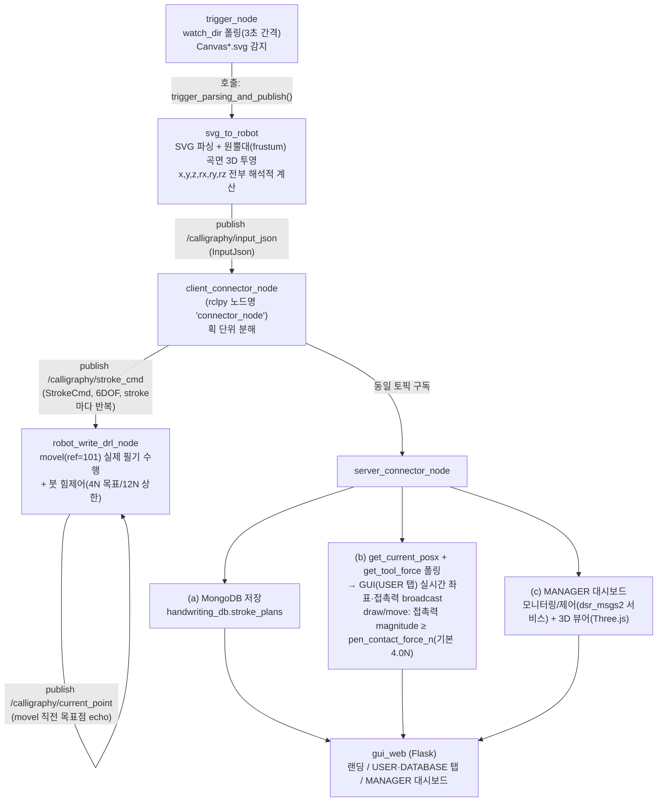

bootbot — M0609 한글 서예 로봇 프로젝트

M0609(두산 로보틱스) + RG2(OnRobot) 그리퍼로 붓을 쥐고 원뿔대(frustum) 곡면 위에 한글 서예를 수행하는 협동로봇 프로젝트. 원래 cobot_rg2 저장소에서 서버/GUI 측(rokey_bootbot)과 로봇 제어 측(calligraphy_robot)을 각각 다른 담당자가 구현했으나, 이 스냅샷에서는 두 구현이 `bootbot`이라는 하나의 패키지로 물리적으로 합쳐졌다. 이 문서는 두 구현을 통합 조망하기 위한 최상위 개요.

패키지 구성

| 구성 | 담당 | 역할 | 문서 |
|---|---|---|---|
| doosan-robot2 | 벤더 제공 | M0609 ROS2 드라이버(dsr_controller2 등) |  |
| onrobot-ros2 / rg2 | 벤더 제공 | RG2 그리퍼 드라이버 |  |
| calligraphy_interfaces | 공용 | InputJson/StrokeCmd(6DOF)/CurrentPoint 메시지 정의 — 서버·로봇 양측 공유 |  |
| bootbot (로봇측) | 로봇측(client) | SVG → 원뿔대 곡면 투영 → movel() 실제 필기 수행 | client_README.md |
| bootbot (서버측) | 서버측(server) | MongoDB 저장, GUI 웹(USER/DATABASE/MANAGER), 로봇 모니터링·제어 | server_README.md |

전체 파이프라인

현재 진행 상태

- **로봇측**: 원뿔대(frustum) 곡면 서예 설계가 이미 라이브 코드에 반영되어 있다 — StrokeCmd에 z/rx/ry/rz가 실제로 채워져 오가고, svg_to_robot.py가 곡면 투영과 자세(rx/ry/rz) 계산을 직접 수행한다. 예전에 스테이징 전용이던 6DOF 설계가 이 스냅샷에서는 병합 완료 상태.
- **서버측**: 6DOF StrokeCmd 저장/재발행, 접촉력 기반 draw/move 판정(z 높이 기준 방식에서 전환됨), USER 탭 캔버스의 곡면 "펼치기(unwrap)" 렌더링, MANAGER 대시보드(모니터링+제어+3D 뷰어) 모두 기능 완성 상태. 상세는 server_README.md 참고.

서버 ↔ 로봇 인터페이스 경계

- StrokeCmd가 이미 6DOF로 확장된 상태이므로, 이 인터페이스가 다시 바뀌면(추가 필드 등) 서버측 저장 스키마/재발행 로직과 로봇측 msg_to_stroke/is_valid_stroke_msg를 함께 갱신해야 함
- 좌표계 일치가 새로운 결합 지점: 로봇측(ref_coord=101 하드코딩)과 서버측(tcp_ref_coord 파라미터, 기본 101)이 같은 사용자 좌표계를 가리켜야 GUI 표시/DB 저장 좌표가 실제 필기 좌표와 일치함(이 스냅샷에서는 두 값이 일치함을 확인함)

실행 순서 (요약)

1. 두산 로보틱스/OnRobot 드라이버 기동 (m0609_rg2_bringup 등, 이 스냅샷에는 미포함)
2. MongoDB 기동 확인
3. 로봇측 노드 기동: client_connector_node → robot_write_drl_node
4. 로봇측 감시 노드 기동: trigger_node (또는 svg_to_robot을 1회 직접 실행)
5. 서버측 노드/프로세스 기동: server_connector_node → gui_web
6. SVG를 watch_dir에 투입해 자동 제출하거나, GUI USER 탭 "작성 기록" 재실행

세부 파라미터/트러블슈팅은 client_README.md(로봇측), server_README.md(서버측) 참고.
